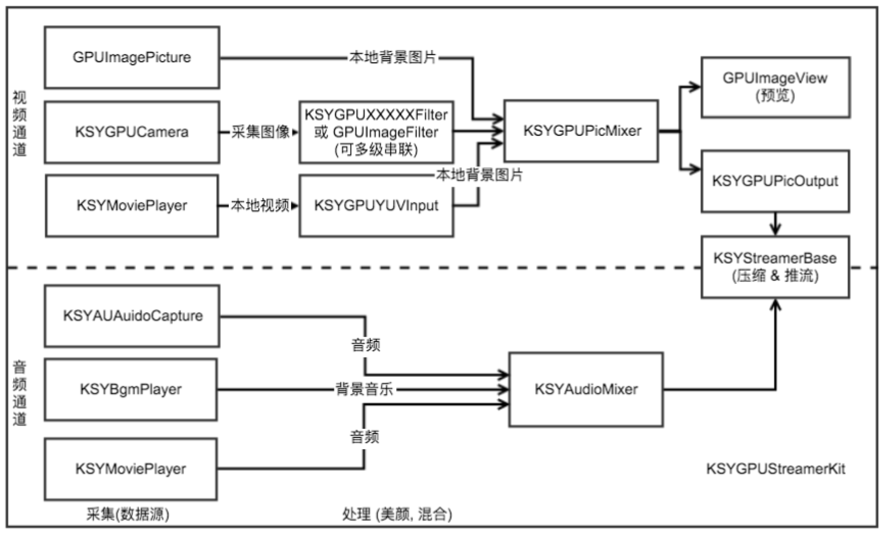
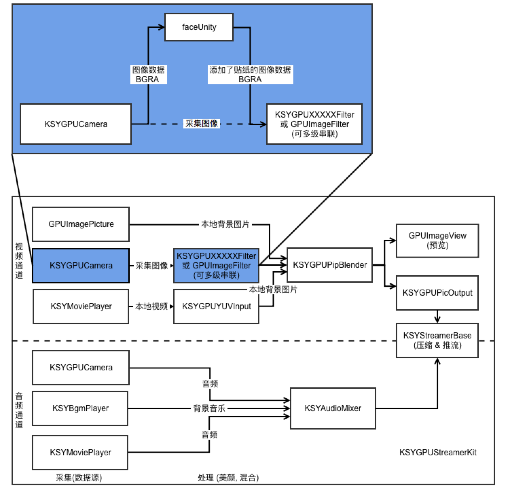
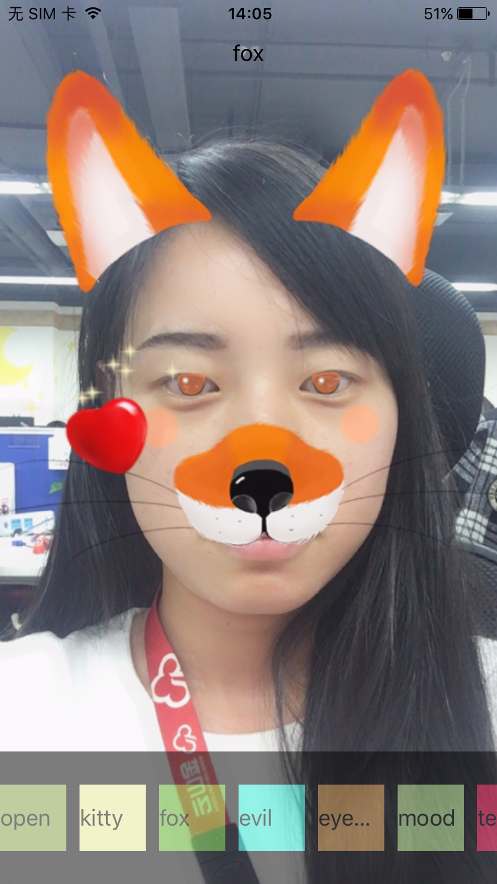
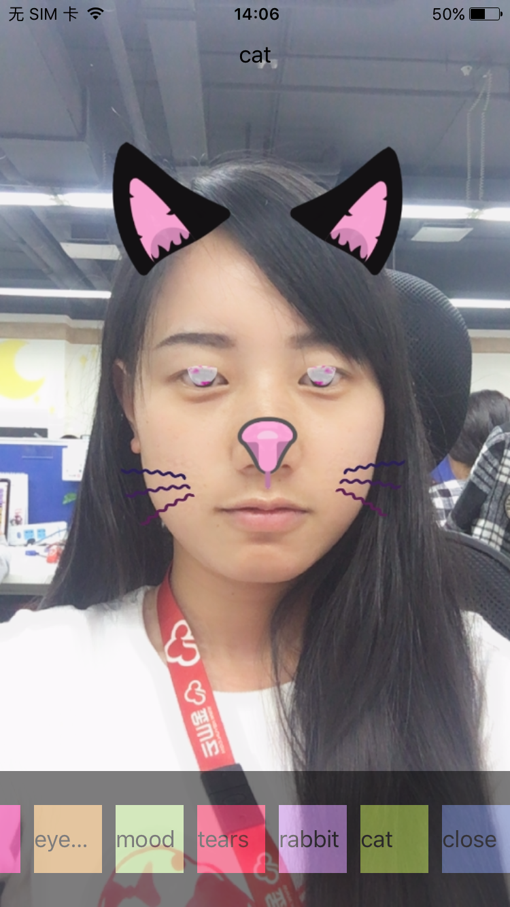
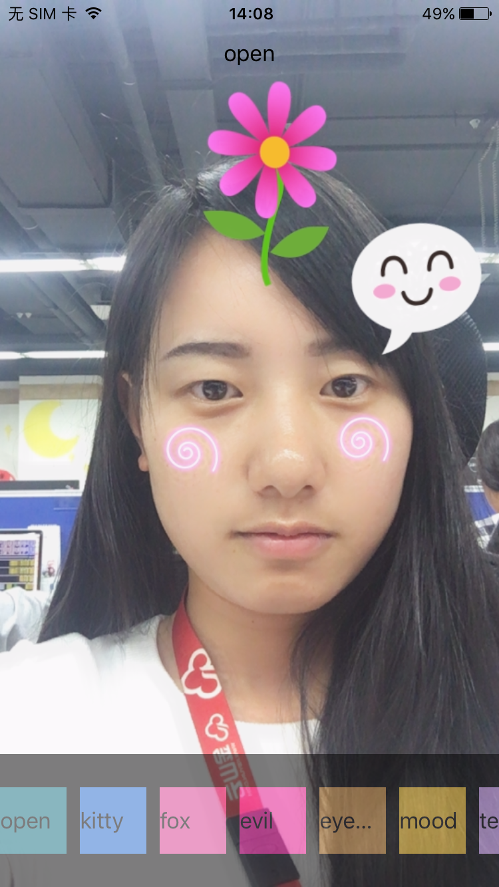
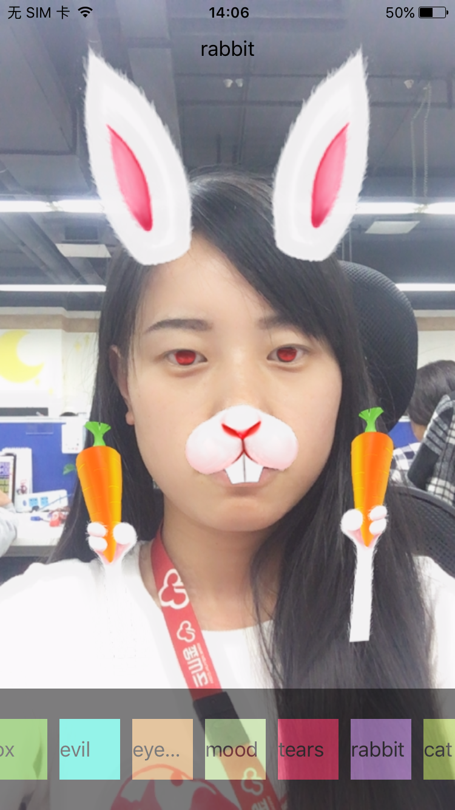
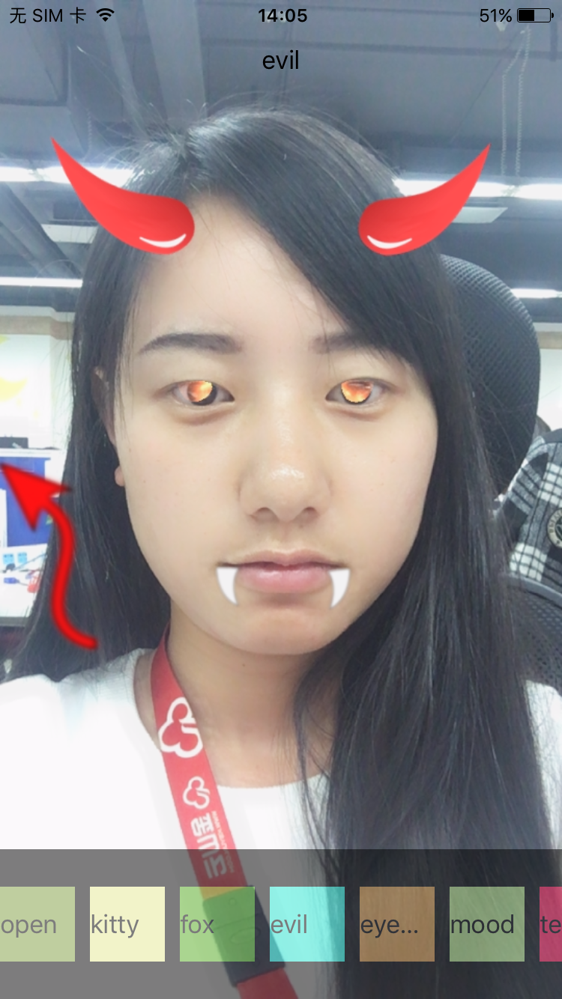
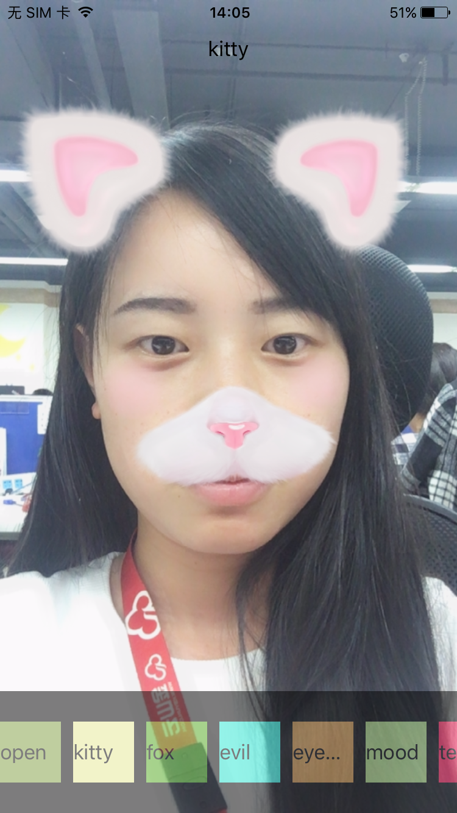

IOS 贴纸功能 （KSYLive_IOS + faceunity）
现在手机直播的发展可谓是如火如荼，玩法也是多种多样，新技术也是层出不群，现在我们就介绍一下基于金山推流SDK和faceunitySDK实现的贴纸功能（人脸识别+贴纸）哎，不错哦！

## 参考资料
请移步 https://github.com/ksvc/KSYLive_iOS

## 使用场景
“你丑你先睡，我美我直播”，贴纸功能的目的就是叫你“就这样一直美下去,就这样萌萌哒“。

## 准备工作
好了言归正传，我们要实现带有可爱的贴纸功能的直播APP，“巧妇难为无米之炊”，首先我们要有原材料：就是能够实现相关功能的SDK（如果你牛，可以自己实现），但是计划赶不上变化，现在的世界就是快的吃慢的，当你加班加点的把这个功能开发完成，你突然发现世界不跟你玩了。所以我们还是集成现在市面上已经完美的轮子，让自己的车跑的更快
1.创建一个自己的直播project

2.集成金山云直播SDK，集成方法可参考 https://github.com/ksvc/KSYLive_iOS

3.集成faceunity，集体方法可见KSYFaceUnityKitDemo中的方法

4.我们要做的工作
    
  目前金山SDK流程结构图：
    
  
  
  那我们要做的事情是啥呢，请看下图：
  
  

## 注意事项
1. 集成金山云SDK：

 （1）在含有xxx.xcodeproj的文件夹中新建Podfile文件
    终端中进入目标文件
     ```
     cd destination
     vim Podfile
     ```
 （2）在Podfile添加pod项目
     ```
     pod 'libksygpulive/libksygpulive', :git => 'https://github.com/ksvc/KSYLive_iOS.git', :tag => 'v1.8.0'//在V1.8.0版本及以后
     ```
     
2. 集成faceunity：
    
    下载KSYFaceUnityKitDemo，将文件夹中的libnama.a的.a文件和funama.h文件拷贝到自己的项目中；
    
3. 资源加载方法
    
    项目中使用的贴纸资源，可以将资源文件放在自己的服务器上，开启APP，当选择选择相应的贴纸样式的时候，从服务器端加载资源，资源下载可以使用苹果原生的NSURLSession的方法，也可以用开源框架AFNetWorking等，这里要注意，网络请求在子线程中操作，并且比较耗时，在添加贴纸的时候，一定要保证资源已下载在本地，否则会发生错误！
    
4. 流程介绍
    
    金山云SDK提供了多种图像数据处理接口，来去自如，可以对接多种图像数据，我们可以提供纹理数据、RGBA、YUV等数据，也一个接收多种多样的图像数据。这样大限度的满足客户需求，在这里faceUnity的IO数据格式都为BGRA，我们能够很好的对接。
    
5. 接口介绍
    
    （1）摄像图数据回调 KSYGPUCamera
     ```
    /**
     @abstract   视频处理回调接口
     @discussion sampleBuffer 原始采集到的视频数据
     @discussion 请注意本函数的执行时间，如果太长可能导致不可预知的问题
     @discussion 请参考 CMSampleBufferRef
     */
     @property(nonatomic, copy) void(^videoProcessingCallback)(CMSampleBufferRef sampleBuffer);
     ```
     (2) 数据转换接口 (YUV ---> BGRA) KSYGPUPicOutput
     ```
    /**
    @abstract   视频处理回调接口
    @discussion pixelBuffer 美颜处理后，编码之前的视频数据
    @discussion timeInfo    时间戳
    @warnning   请注意本函数的执行时间，如果太长可能导致不可预知的问题
     */
     @property(nonatomic, copy) void(^videoProcessingCallback)(CVPixelBufferRef pixelBuffer, CMTime timeInfo );
     ```
     (3) 数据接口 （YUV ---> texture）KSYGPUYUVInput
     ```
     /**
     @abstract 输入图像数据
     @param    sampleBuffer 图像数据和时间信息
     */
    - (void)processSampleBuffer:(CMSampleBufferRef)sampleBuffer;
    ```
    ```
    /**
     @abstract 输入图像数据
     @param    pixelBuffer 图像数据
     @param    timeInfo    时间信息
     */
    - (void)processPixelBuffer:(CVPixelBufferRef)pixelBuffer
                      time:(CMTime)timeInfo;
     ```
     
## 效果展示
| | |
| :---: | :---:|
|fox| cat |
|| |
|mood| rabbit |
|| |
|evil| kitty |
|| |


## 商务合作
demo中的贴纸功能，若没有没有满足您的需求那么请联系：

faceunity:http://www.faceunity.com

金山：https://github.com/ksvc/KSYLive_iOS    
