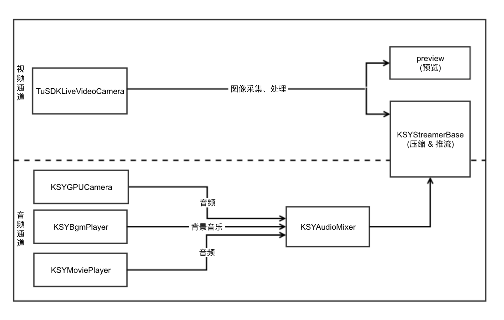
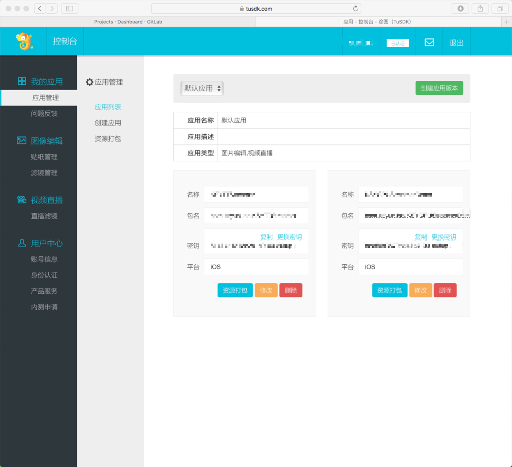
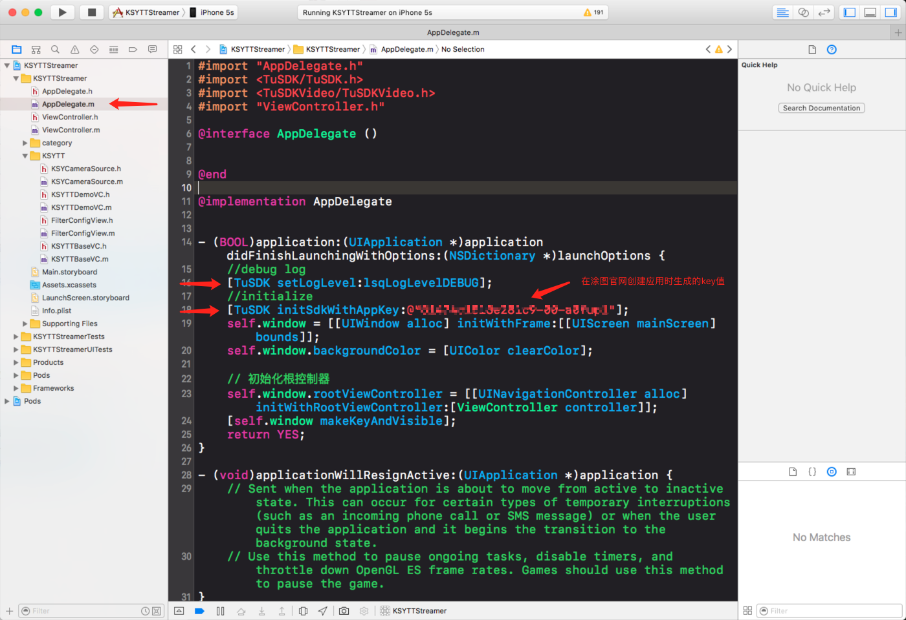
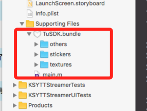

### 概述
可扩展性是金山SDK的重要特征，下面就介绍一下金山SDK+途图SDK完成视频采集、图像处理、推流的相关功能
### 集成
#### 准备工作
资源下载：

金山SDK：https://github.com/ksvc/KSYLive_iOS

途图SDK：https://tusdk.com

#### 结构图

金山SDK流程结构图：
    

  
那我们要做的事情是啥呢，请看下图：
  


#### 开始集成

重要功能类介绍：
```
TuSDKLiveVideoCamera:视频直播相机 (采集 + 处理 + 输出)
- (void)setCamera{
    //销毁相机
    [self destoryCamera];
    //初始化相机
    _camera = [TuSDKLiveVideoCamera initWithSessionPreset:self.sessionPreset cameraPosition:self.avPostion cameraView:self.cameraView];
    //相机代理
    _camera.videoDelegate = self;
    //图像输出尺寸
    _camera.outputSize = _outputSize;
    //焦距调节
    _camera.disableTapFocus = YES;
    _camera.disableContinueFoucs = NO;
    _camera.cameraViewRatio = 0;
    _camera.regionViewColor = [UIColor blackColor];
    _camera.disableMirrorFrontFacing = NO;
    _camera.frameRate = 15;
    [_camera flashWithMode:_flashMode];
    [_camera switchFilterWithCode:nil];
    [_camera tryStartCameraCapture];
}
//开启相机
- (void)startRunning{
    [self startCamera];
    [_camera startRecording];
}
//关闭相机
- (void)stopRunning{
    if (!_camera) {
        return;
    }
    [self destoryCamera];
    [_camera cancelRecording];
}
//数据回调
- (void)onVideoCamera:(TuSDKLiveVideoCamera *)camera bufferData:(CVPixelBufferRef)pixelBuffer time:(CMTime)frameTime{
    if (self.delegate && [self.delegate respondsToSelector:@selector(capSource:pixelBuffer:time:)]) {
        [self.delegate capSource:self pixelBuffer:pixelBuffer time:frameTime];
    }
}
//更加详细的相机控制请看Demo
```
```
KSYGPUStreamerKit: 推流工具类（图像采集 + 处理 + 推流），这里的图像采集、处理功能我们将用TuSDKLiveVideoCamera来替换
- (void)kitDefaultInit{
_kit = [[KSYGPUStreamerKit alloc] initWithDefaultCfg];
}
//编码推流参数配置
- (void) defaultStramCfg{
    // stream default settings
    _kit.streamerBase.videoCodec = KSYVideoCodec_AUTO;
    _kit.streamerBase.videoInitBitrate =  800;
    _kit.streamerBase.videoMaxBitrate  = 1000;
    _kit.streamerBase.videoMinBitrate  =    0;
    _kit.streamerBase.audiokBPS        =   48;
    _kit.streamerBase.enAutoApplyEstimateBW     = YES;
    _kit.streamerBase.shouldEnableKSYStatModule = YES;
    _kit.streamerBase.videoFPS = 15;
    _kit.streamerBase.logBlock = ^(NSString* str){
        NSLog(@"%@", str);
    };
    _hostURL = [NSURL URLWithString:@"rtmp://test.uplive.ksyun.com/live/123"];
}
// 组装声音通道
- (void) setupAudioPath {
    __weak KSYTestKit * kit = self;
    //1. 音频采集, 语音数据送入混音器
    _aCapDev.audioProcessingCallback = ^(CMSampleBufferRef buf){
        [kit mixAudio:buf to:kit.micTrack];
    };
     _aMixer.audioProcessingCallback = ^(CMSampleBufferRef buf){
        if (![kit.streamerBase isStreaming]){
         return;
        }
        [kit.streamerBase processAudioSampleBuffer:buf];
     };
    // mixer 的主通道为麦克风,时间戳以main通道为准
    _aMixer.mainTrack = _micTrack;
    [_aMixer setTrack:_micTrack enable:YES];
}
//更加详细的相机控制请看Demo
```
###资源获取
途图资源获取：

可以登录涂图官网：https://tusdk.com

下面说明一下我在集成过程中的操作步骤：
1.注册账号，申请权限
2.进入控制台
3.创建自己的应用
4.管理贴纸、滤镜资源
5.资源打包下载，更新配置

代码中需要注意的地方：

资源下载：


TuSDK初始化：


添加资源到项目中：



详情请咨询：https://tusdk.com

金山SDK资源获取：

可以登录：https://github.com/ksvc/KSYLive_iOS
这里有详细的集成介绍。
